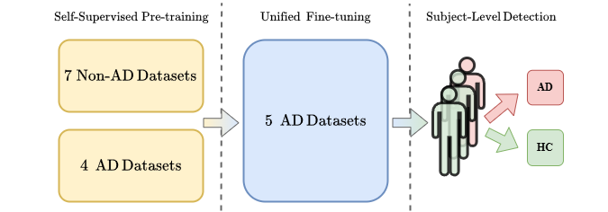
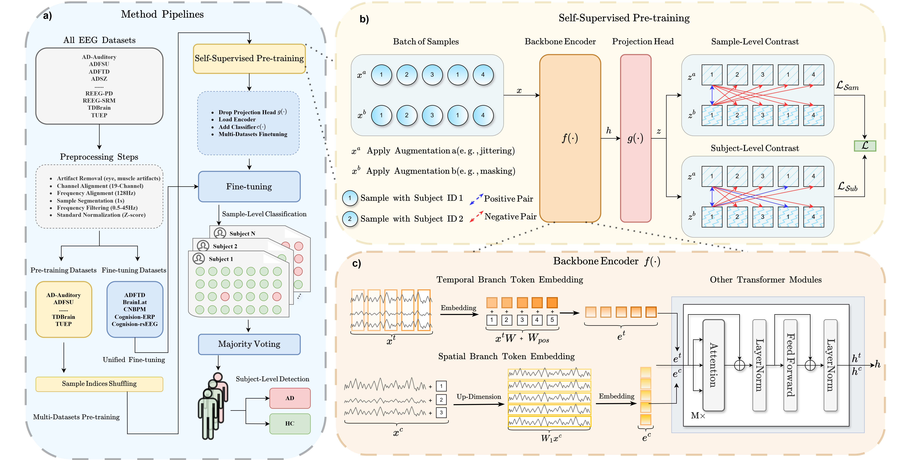
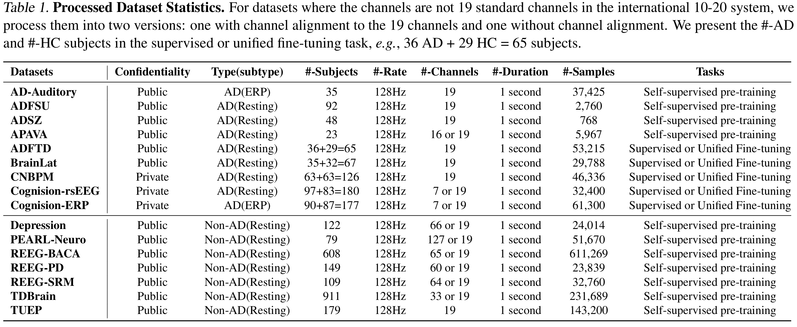

# LEAD: Large Foundation Model for EEG-Based Alzheimer’s Disease Detection

## Overview of LEAD


This repository contains the description of 16 datasets and the code of the LEAD method for the paper 
*LEAD: Large Foundation Model for EEG-Based Alzheimer’s Disease Detection*. 
In this paper, we introduce the world's first large foundation model for EEG-based Alzheimer's disease detection, 
trained on the world's largest EEG-AD corpus so far containing 813 subjects.
Our method encompasses an entire pipeline, from data selection and preprocessing to self-supervised contrastive pretraining, fine-tuning, and key setups such as subject-independent evaluation and majority voting for subject-level detection. 
We pre-train the model on 11 EEG Non-AD datasets and unified fine-tune it on 5 AD datasets. 
Our self-supervised pre-training design includes sample-level and subject-level contrasting to extract useful general EEG features. 
Fine-tuning is performed on 5 channel-aligned datasets together. 
The backbone encoder incorporates temporal and channel embeddings to capture features across both temporal and spatial dimensions. 
Our method demonstrates outstanding AD detection performance, achieving up to a 9.86\% increase in F1 score at the sample-level and up to a 9.31\%  at the subject-level compared to state-of-the-art methods. 
The results of our model strongly confirm the effectiveness of contrastive pre-training and channel-aligned unified fine-tuning for addressing inter-subject variation.


## Details of LEAD


**a)** The pipeline for our method includes data preprocessing, sample indices shuffling, self-supervised pre-training, multi-dataset fine-tuning, sample-level classification, and subject-level AD detection. 
**b)** The flowchart of the self-supervised pre-training. A batch of samples is applied with two augmentations $a$ and $b$ to generate two augmented views, ${x}_i^a$ and ${x}_i^b$. 
The number in each sample is the subject ID. The representation ${z}_i^a$ and ${z}_i^b$ after encoder $f(\cdot)$ and projection head $g(\cdot)$ are used for contrastive learning. 
Two augmented views from the same sample are positive pairs for sample-level contrast. For subject-level contrast, samples with the same subject IDs are positive pairs. 
**c)** The backbone encoder $f(\cdot)$ includes two branches. The temporal branch takes cross-channel patches to embed as tokens. 
The spatial branch takes the whole series of channels to embed as tokens. The temporal and spatial branches are computed in parallel.

## Datasets
### a) Data Selection
We refer to datasets that include Alzheimer's Disease (AD) subjects as AD datasets, 
while datasets that do not include AD subjects are called non-AD datasets. 
In total, we have 9 AD datasets and 7 non-AD datasets. 
Note that all the non-AD datasets have one commonality: the label is assigned to each subject, 
which adapts to the subject-level contrastive learning.

1) **AD Datasets.** We select 6 public AD datasets by reviewing EEG-based AD detection papers published between 2018 and 2024.
They are [AD-Auditory](https://openneuro.org/datasets/ds005048/versions/1.0.0), [ADFSU](https://osf.io/2v5md/), 
[ADFTD](https://openneuro.org/datasets/ds004504/versions/1.0.8), [ADSZ](https://figshare.com/articles/dataset/Alzheimer_s_disease_and_Schizophrenia/19091771), 
[APAVA](https://osf.io/jbysn/), and [BrainLat](https://www.synapse.org/Synapse:syn51549340/wiki/624187). 
Additionally, we use 3 private datasets: Cognision-ERP, Cognision-rsEEG, and CNBPM, 
bringing the total number of AD datasets to 9.
Five large and high-quality AD datasets, [ADFTD](https://openneuro.org/datasets/ds004504/versions/1.0.8), [BrainLat](https://www.synapse.org/Synapse:syn51549340/wiki/624187), 
CNBPM, Cognision-rsEEG, and Cognision-ERP, 
are used for downstream fine-tune classification to evaluate the model performance.

2) **Non-AD Datasets.** We select 7 neurological disease or healthy large datasets, each with hundreds or even thousands of subjects. 
They are [Depression](https://openneuro.org/datasets/ds003478/versions/1.1.0), 
[PEARL-Neuro](https://openneuro.org/datasets/ds004796/versions/1.0.9), 
[REEG-BACA](https://openneuro.org/datasets/ds005385/versions/1.0.2), 
[REEG-PD](https://openneuro.org/datasets/ds004584/versions/1.0.0), 
[REEG-SRM](https://openneuro.org/datasets/ds003775/versions/1.2.1), 
[TDBrain](https://www.synapse.org/Synapse:syn25671079/wiki/610278), 
and [TUEP](https://isip.piconepress.com/projects/nedc/html/tuh_eeg/).
To enhance the learning of general EEG and AD-specific features, 
we use these datasets for self-supervised pretraining aiming to increase the diversity of brain conditions, including healthy and diseased states, 
and increase the number of subjects used for training to reduce the interference of subject-specific patterns.

### b) Data Preprocessing
1) **Artifacts Removal.** Some datasets have already undergone preprocessing steps during data collection, such as artifact removal and filtering. We perform a secondary preprocessing to align all datasets uniformly for training. All the fine-tuning datasets are guaranteed to be artifacts-free.

2) **Channel Alignment.** We align all datasets to a standard set of 19 channels, which include Fp1, Fp2, F7, F3, Fz, F4, F8, T3/T7, C3, Cz, C4, T4/T8, T5/P7, P3, Pz, P4, T6/P8, O1, and O2, based on the international [10-20 system](https://en.wikipedia.org/wiki/10-20_system_(EEG)). For datasets with fewer than 19 channels, we interpolate the missing channels using the [MNE](https://mne.tools/stable/index.html) EEG processing package. 
For datasets with more than 19 channels, we select the 19 channels based on the channel name and discard the others. In cases where datasets use different channel montages, such as the [Biosemi](https://www.biosemi.com/headcap.htm) headcaps with 32, 64, 128 channels, we select the 19 closest channels by calculating the Euclidean distance between their 3D coordinates. The channel alignment allows us to pre-train the models on different datasets with any backbone encoder and perform unified fine-tuning on all AD datasets in one run.
 
3) **Frequency Alignment.** In addition to channel alignment, we resample all datasets to a uniform sampling frequency of 128Hz, which is commonly used and preserves the key frequency bands (delta δ, theta θ, alpha α, beta β, gamma γ), while also reducing noise.

4) **Sample Segmentation.** For deep learning training, we segment the EEG trials within each subject into 1-second samples, which results in 128 timestamps per sample, as the sampling frequency is aligned to 128Hz. 

5) **Frequency Filtering.** We then apply frequency filtering to each sample, ranging from 0.5Hz to 45Hz, to remove frequency bands that do not correspond to brain activities.

6) **Standard Normalization.** After frequency filtering, we perform standard normalization on each sample, applied individually to each channel, to ensure that the data is centered and scaled consistently.


### c) Processed Datasets

1) **Datasets Statistics.** We pre-train on 11 datasets: **AD-Auditory**, **ADFSU**, **ADSZ**, **APAVA**, 
**Depression**, **PEARL-Neuro**, **REEG-BACA**, **REEG-PD**, **REEG-SRM**, **TDBrain**, and **TUEP**, 
and fine-tuning on 5 downstream datasets: **ADFTD**, **BrainLat**, **CNBPM**, **Cognision-ERP**, and **Cognision-rsEEG**. 
The pre-training datasets include 7 non-AD neurological diseases or healthy subjects and 4 AD datasets, 
totaling **2,354** subjects and **1,165,361** 1-second, 128Hz samples. 
All downstream datasets are binary classifications between AD patients and healthy subjects, 
totaling **615** subjects and **223,039** 1-second, 128Hz samples. 
The 9 AD datasets used for pre-training or fine-tuning consist of **813** subjects in total.
Download the raw data from the links above in Data Selection and run notebooks in the folder `data_preprocessing/` for each raw dataset to get the processed dataset.
For datasets need to align the channel, we provide two versions of data processing files, one for the raw channel data and the other for the aligned channel data.

2) **Datasets Folder Paths.** The -19 suffix at the end of folder means the data was interpolated or selected into 19 channels (e.g, BrainLat-19), while no suffix means the data was not interpolated or selected into 19 channels (e.g, BrainLat).
The folder for processed datasets has two directories: `Feature/` and `Label/`. 
The folder `Feature/` contains files named in the format `feature_ID.npy` files for all the subjects, where ID is the patient ID. 
Each`feature_ID.npy` file contains samples belonging to the same subject and stacked into a 3-D array with shape [N-sample, T, C], where N-sample denotes the number of samples in the subject with XX ID, T denotes the timestamps for a sample, and C denotes the number of channels. 
Notice that different subjects may have different numbers of samples.
The folder `Label/` has a file named `label.npy`. This label file is a 2-D array with shape [N-subject, 2], where N-subject denotes the number of subjects. The first column is the subject's label(e.g., healthy or AD), and the second column is the subject ID, ranging from 1 to N-subject.
The processed data should be put into `dataset/DATA_NAME/` so that each subject file can be located by `dataset/DATA_NAME/Feature/feature_ID.npy`, and the label file can be located by `dataset/DATA_NAME/Label/label.npy`.  

3) **Processed Datasets Download link.** The processed datasets can be manually downloaded at the following link: 
https://drive.google.com/drive/folders/1KffFxezXzgIw-hseMmgLFy8xE31pXpYM?usp=drive_link. 
Since TDBrain and TUEP need permission to get access first, we do not provide the processed version of dataset in the folder. 
Users need to request permission to download the raw data on the TDBrain and TUEP official website and preprocess it with the jupyter notebook we provided.

## Requirements  
  
The recommended requirements are specified as follows:  
* Python 3.8  
* Jupyter Notebook  
* einops==0.4.0
* matplotlib==3.7.0
* numpy==1.23.5
* pandas==1.5.3
* patool==1.12
* reformer-pytorch==1.4.4
* scikit-learn==1.2.2
* scipy==1.10.1
* sktime==0.16.1
* sympy==1.11.1
* torch==2.0.0
* tqdm==4.64.1
* wfdb==4.1.2
* neurokit2==0.2.9
* mne==1.6.1 
  
The dependencies can be installed by:  
```bash  
pip install -r requirements.txt
```


## Run Experiments
Before running, make sure you have all the processed datasets put under `dataset/`. 
You can see the scripts in `scripts/` as a reference. 
You could also run all the experiments by putting scripts line by line the `meta-run.sh` file.
The gpu device ids can be specified by setting command line `--devices` (e,g, `--devices 0,1,2,3`). 
You also need to change the visible gpu devices in script file by setting `export CUDA_VISIBLE_DEVICES` (e,g, `export CUDA_VISIBLE_DEVICES=0,1,2,3`). 
The gpus specified by commend line should be a subset of visible gpus.


Given the parser argument `--method`,`--task_name`, `--model`, and `--model_id` in `run.py`, 
the saved model can be found in`checkpoints/method/task_name/model/model_id/`; 
and the results can be found in  `results/method/task_name/model/model_id/`. 
You can modify the parameters by changing the command line. 
The meaning and explanation of each parameter in command line can be found in `run.py` file.


## Train from Scratch
Since three of the datasets are private, it is not feasible to train our model from scratch using all the datasets. 
However, you can still train the model partially by utilizing the public datasets. 
Here are some examples for supervised learning, self-supervised pre-training, and fine-tuning:

a) Supervised Training on ADFTD and BrainLat dataset 
```bash  
# ADFTD Dataset
python -u run.py --method LEAD --task_name supervised --is_training 1 --root_path ./dataset/ --model_id S-ADFTD-Sup --model LEAD --data SingleDataset \
--training_datasets ADFTD \
--testing_datasets ADFTD \
--e_layers 12 --batch_size 128 --n_heads 8 --d_model 128 --d_ff 256 --swa \
--des 'Exp' --itr 5 --learning_rate 0.0001 --train_epochs 100 --patience 15

# BrainLat Dataset
python -u run.py --method LEAD --task_name supervised --is_training 1 --root_path ./dataset/ --model_id S-BrainLat-Sup --model LEAD --data SingleDataset \
--training_datasets BrainLat \
--testing_datasets BrainLat \
--e_layers 12 --batch_size 128 --n_heads 8 --d_model 128 --d_ff 256 --swa \
--des 'Exp' --itr 5 --learning_rate 0.0001 --train_epochs 100 --patience 15
```

b) Unified Supervised Training on ADFTD and BrainLat-19 dataset 
```bash
# Training
python -u run.py --method LEAD --task_name supervised --is_training 1 --root_path ./dataset/ --model_id S-2-Sup --model LEAD --data MultiDatasets \
--training_datasets ADFTD,BrainLat-19 \
--testing_datasets ADFTD,BrainLat-19 \
--e_layers 12 --batch_size 128 --n_heads 8 --d_model 128 --d_ff 256 --swa \
--des 'Exp' --itr 5 --learning_rate 0.0001 --train_epochs 100 --patience 15

# Test
# ADFTD
python -u run.py --method LEAD --task_name supervised --is_training 0 --root_path ./dataset/ --model_id S-2-Sup --model LEAD --data MultiDatasets \
--testing_datasets ADFTD \
--e_layers 12 --batch_size 128 --n_heads 8 --d_model 128 --d_ff 256 --swa \
--des 'Exp' --itr 5 --learning_rate 0.0001 --train_epochs 100 --patience 15

# BrainLat-19
python -u run.py --method LEAD --task_name supervised --is_training 0 --root_path ./dataset/ --model_id S-2-Sup --model LEAD --data MultiDatasets \
--testing_datasets BrainLat-19 \
--e_layers 12 --batch_size 128 --n_heads 8 --d_model 128 --d_ff 256 --swa \
--des 'Exp' --itr 5 --learning_rate 0.0001 --train_epochs 100 --patience 15
```


c) Self-supervised Pre-training on 11 pre-training datasets (7 non-AD datasets and 4 AD datasets)
```bash
python -u run.py --method LEAD --task_name pretrain_lead --is_training 1 --root_path ./dataset/ --model_id P-11-Base --model LEAD --data MultiDatasets \
--pretraining_datasets ADSZ,APAVA-19,ADFSU,AD-Auditory,TDBRAIN-19,TUEP,REEG-PD-19,PEARL-Neuro-19,Depression-19,REEG-SRM-19,REEG-BACA-19 \
--training_datasets ADFTD,BrainLat-19 \
--testing_datasets ADFTD,BrainLat-19 \
--e_layers 12 --batch_size 512 --n_heads 8 --d_model 128 --d_ff 256 --swa \
--des 'Exp' --itr 5 --learning_rate 0.0002 --train_epochs 50
```

d) Unified Fine-tuning on 2 public AD datasets (ADFTD and BrainLat-19) and Test the Performance
```bash
# Fine-tuning
python -u run.py --method LEAD --checkpoints_path ./checkpoints/LEAD/pretrain_lead/LEAD/P-11-Base/ --task_name finetune --is_training 1 --root_path ./dataset/ --model_id P-11-F-2-Base --model LEAD --data MultiDatasets \
--training_datasets ADFTD,BrainLat-19 \
--testing_datasets ADFTD,BrainLat-19 \
--e_layers 12 --batch_size 128 --n_heads 8 --d_model 128 --d_ff 256 --swa \
--des 'Exp' --itr 5 --learning_rate 0.0001 --train_epochs 100 --patience 15

# Test
# ADFTD
python -u run.py --method LEAD --task_name finetune --is_training 0 --root_path ./dataset/ --model_id P-11-F-2-Base --model LEAD --data MultiDatasets \
--testing_datasets ADFTD \
--e_layers 12 --batch_size 128 --n_heads 8 --d_model 128 --d_ff 256 --swa \
--des 'Exp' --itr 5 --learning_rate 0.0001 --train_epochs 100 --patience 15

# BrainLat-19
python -u run.py --method LEAD --task_name finetune --is_training 0 --root_path ./dataset/ --model_id P-11-F-2-Base --model LEAD --data MultiDatasets \
--testing_datasets BrainLat-19 \
--e_layers 12 --batch_size 128 --n_heads 8 --d_model 128 --d_ff 256 --swa \
--des 'Exp' --itr 5 --learning_rate 0.0001 --train_epochs 100 --patience 15
```


# Apply Our Pre-trained Model on Your Own Dataset
We provide a guideline to apply our pre-trained model on your own custom dataset step by step.

### 1. Preprocess Your Custom EEG-Based AD Detection Dataset
Suppose your new custom EEG-Based AD detection dataset is named `CUSTOM`. 
You can preprocess the dataset by following the same pipeline as our method described in the Data Preprocessing section.
Take the files in `data_preprocessing/` as a reference to design your new preprocessing file.
The first four preprocessing steps includes artifact removal, channel alignment, frequency alignment, sample segmentation should be applied to the new custom dataset in this step.
The processed data is a 19-channel EEG dataset with 1-second samples at 128Hz.
The channel order should be Fp1, Fp2, F7, F3, Fz, F4, F8, T3/T7, C3, Cz, C4, T4/T8, T5/P7, P3, Pz, P4, T6/P8, O1, and O2.
The processed dataset `CUSTOM` should have two folders: `Feature/` and `Label/`. 
The folder `Feature/` contains files named in the format `feature_ID.npy`, each ID corresponding to a subject. 
Each`feature_ID.npy` file contains samples belonging to the same subject and stacked into a 3-D array with shape [N-sample, 128, 19], 
where N-sample denotes the number of samples in this subject, 128 denotes the timestamps for a sample, and 19 denotes the number of channels.
The processed data should be put into `dataset/CUSTOM/` so that each subject file can be located by `dataset/CUSTOM/Feature/feature_ID.npy`, 
and the label file can be located by `dataset/CUSTOM/Label/label.npy`.

### 2. Load Your Custom EEG-Based AD Detection Dataset
Create a new file named `custom_loader.py` in the `data_provider/dataset_loader/` folder to load the new custom dataset.
Write a customized class `CUSTOMLoader` in  `data_provider/dataset_loader/custom_loader.py` to load the data.
Take the files in `data_provider/dataset_loader/` as a reference to design your new loader file. 
The goal is to perform **subject-independent** evaluation on the new custom dataset.
Based on your requirements, you can split the subjects in a fixed ratio, Monte Carlo cross-validation, or leave-one-subject-out cross-validation.
The rest of two preprocessing steps including frequency filtering and standard normalization should be applied to the new custom dataset in this step.
Import the `CUSTOMLoader` class in `data_provider/data_loader.py` and add the dataset named `CUSTOM` in `data_folder_dict` like `'CUSTOM': CUSTOMLoader`.
Now you are able to load the new dataset by passing its name in the `run.py`.
Depending on the training task, the new dataset can be added in `--pretraining_datasets`, `--training_datasets`, or `--testing_datasets` in the command line.
If you simply want to finetune our pre-trained model on the new custom dataset, you can add the new dataset in `--training_datasets` and `--testing_datasets`.

### 3. Download Our Pre-trained Model
The pretrained model can be downloaded from the following link:
https://drive.google.com/drive/folders/1JDg0VxbML6pIrzxzm9GXiC6ixUIgujt9?usp=sharing.
Place the downloaded checkpoints folder `LEAD` under folder `checkpoints/`.
The folder path is organized as `./checkpoints/method/task_name/model/model_id/`,
where the description of `--method`, `--task_name`, `--model`, and `--model_id` can be found in the `run.py` file.
For here, the `--method` and `--model` should be `LEAD`, 
the `--task_name` should be `pretrain_lead`, `supervised`, or `finetune`, 
and the `--model_id` should be the model name you want to use.


### 4. Finetune Our Pre-trained Model on Your Custom Dataset and Test the Performance
We provided four choices to utilized our pre-trained model on the new custom dataset.
For choices **a)**, **b)**, and **c)**, the new custom dataset should be a binary classification dataset between AD patients(class 1) and healthy subjects(class 0).
It is possible to try binary classification between AD patients(class 1) and non-AD subjects(including healthy and other neurological diseases, all assigned to class 0), but the performance is not guaranteed.
For choice **d)**, there is no specific requirements for the number of classes in the new custom dataset.
You can modify the projection head in the code to adapt to any number of classes in your new custom dataset.
It is even possible to use our pre-trained model for tasks beyond EEG-based AD detection since the model has learned features of other neurological diseases, 
such as Parkinson's Disease, Depression, and Epilepsy.

The sample and subject-level performance can be found in the `results/LEAD/finetune/LEAD/model_id/` folder,
where `--model_id` is the model name you used in the command line.

#### a) Finetune the LEAD-Sup model in our paper (Named S-5-Sup in the code) on the new custom dataset:
```bash
# fine-tuning
python -u run.py --method LEAD --checkpoints_path ./checkpoints/LEAD/supervised/LEAD/S-5-Sup/ --task_name finetune --is_training 1 --root_path ./dataset/ --model_id S-5-F-CUSTOM-Base --model LEAD --data MultiDatasets \
--training_datasets CUSTOM \
--testing_datasets CUSTOM \
--e_layers 12 --batch_size 128 --n_heads 8 --d_model 128 --d_ff 256 --swa \
--des 'Exp' --itr 5 --learning_rate 0.0001 --train_epochs 100 --patience 15

# test
python -u run.py --method LEAD --task_name finetune --is_training 0 --root_path ./dataset/ --model_id S-5-F-CUSTOM-Base --model LEAD --data MultiDatasets \
--training_datasets CUSTOM \
--testing_datasets CUSTOM \
--e_layers 12 --batch_size 128 --n_heads 8 --d_model 128 --d_ff 256 --swa \
--des 'Exp' --itr 5 --learning_rate 0.0001 --train_epochs 100 --patience 15
```

#### b) Finetune the LEAD-Base model in our paper (Named P-11-F-5-Base in the code) on the new custom dataset:
```bash
# fine-tuning
python -u run.py --method LEAD --checkpoints_path ./checkpoints/LEAD/finetune/LEAD/P-11-F-5-Base/ --task_name finetune --is_training 1 --root_path ./dataset/ --model_id P-11-F-5-F-CUSTOM-Base --model LEAD --data MultiDatasets \
--training_datasets CUSTOM \
--testing_datasets CUSTOM \
--e_layers 12 --batch_size 128 --n_heads 8 --d_model 128 --d_ff 256 --swa \
--des 'Exp' --itr 5 --learning_rate 0.0001 --train_epochs 100 --patience 15

# test
python -u run.py --method LEAD --task_name finetune --is_training 0 --root_path ./dataset/ --model_id P-11-F-5-F-CUSTOM-Base --model LEAD --data MultiDatasets \
--training_datasets CUSTOM \
--testing_datasets CUSTOM \
--e_layers 12 --batch_size 128 --n_heads 8 --d_model 128 --d_ff 256 --swa \
--des 'Exp' --itr 5 --learning_rate 0.0001 --train_epochs 100 --patience 15
```

#### c) Unified finetune your custom dataset with two public AD datasets on the P-14-Base model in our paper(pre-trained on 11 pre-training and 3 private AD datasets):
```bash
# fine-tuning
python -u run.py --method LEAD --checkpoints_path ./checkpoints/LEAD/pretrain_lead/LEAD/P-14-Base/ --task_name finetune --is_training 1 --root_path ./dataset/ --model_id P-14-F-3-Base --model LEAD --data MultiDatasets \
--training_datasets ADFTD,BrainLat-19,CUSTOM \
--testing_datasets ADFTD,BrainLat-19,CUSTOM \
--e_layers 12 --batch_size 128 --n_heads 8 --d_model 128 --d_ff 256 --swa \
--des 'Exp' --itr 5 --learning_rate 0.0001 --train_epochs 100 --patience 15

# test
python -u run.py --method LEAD --task_name finetune --is_training 0 --root_path ./dataset/ --model_id P-14-F-3-Base --model LEAD --data MultiDatasets \
--testing_datasets CUSTOM \
--e_layers 12 --batch_size 128 --n_heads 8 --d_model 128 --d_ff 256 --swa \
--des 'Exp' --itr 5 --learning_rate 0.0001 --train_epochs 100 --patience 15
```

#### d) Finetune the LEAD-All model in our paper (Named P-16-Base in the code) on the new custom dataset:
```bash
# fine-tuning
python -u run.py --method LEAD --checkpoints_path ./checkpoints/LEAD/pretrain_lead/LEAD/P-16-Base/ --task_name finetune --is_training 1 --root_path ./dataset/ --model_id P-16-F-CUSTOM-Base --model LEAD --data MultiDatasets \
--training_datasets CUSTOM \
--testing_datasets CUSTOM \
--e_layers 12 --batch_size 128 --n_heads 8 --d_model 128 --d_ff 256 --swa \
--des 'Exp' --itr 5 --learning_rate 0.0001 --train_epochs 100 --patience 15

# test
python -u run.py --method LEAD --task_name finetune --is_training 0 --root_path ./dataset/ --model_id P-16-F-CUSTOM-Base --model LEAD --data MultiDatasets \
--training_datasets CUSTOM \
--testing_datasets CUSTOM \
--e_layers 12 --batch_size 128 --n_heads 8 --d_model 128 --d_ff 256 --swa \
--des 'Exp' --itr 5 --learning_rate 0.0001 --train_epochs 100 --patience 15
```
Note that the LEAD-All model utilizes all our 16 datasets for pre-training, 
so there is no separate downstream dataset to evaluate its performance. 
Consequently, its performance is not guaranteed to be superior to the LEAD-Sup and LEAD-Base model. 
Theoretically, the LEAD-All model should have learned more general EEG features and AD-specific features.
Note that your custom dataset should have no overlap with the 16 datasets used for pre-training the LEAD-All model to ensure no data leakage.


## Acknowledgement

We want to thank the authors of the EEG datasets used in this paper for generously sharing their data. 
Their efforts and contributions have been invaluable in advancing the field of EEG and EEG-based Alzheimer’s Disease detection.